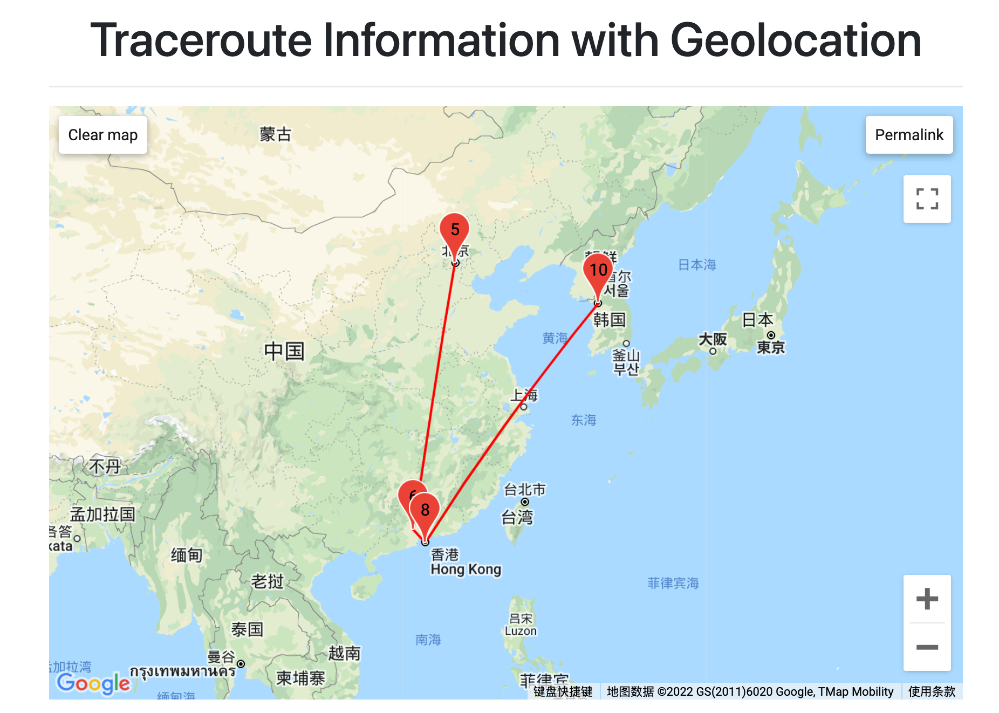

# visual geolocation traceroute


## MTR

What is My Traceroute (MTR)?
My Traceroute (MTR) is a tool that combines traceroute and ping, which is another common method for testing network connectivity and speed. In addition to the hops along the network path, MTR shows constantly updating information about the latency and packet loss along the route to the destination. This helps in troubleshooting network issues by allowing you to see what’s happening along the path in real-time.

MTR works by discovering the network path in a similar manner to traceroute, and then regularly sending packets to continue collecting information to provide an updated view into the network’s health and speed.

Like traceroute, MTR can use ICMP or UDP for outgoing packets but relies on ICMP for return (Type 11: Time Exceeded) packets.

## Install MRT in MacOS

To install mtr, run the command

	brew install mtr


Once MTR is insstalled, simply open your Terminal app and run this command:

	sudo /usr/local/Cellar/mtr/0.95/sbin/mtr -n -r m1.zfdang.com
	
Then you will get report like:

```Start: 2022-03-28T11:19:08+0800
HOST: zfdang-mac                  Loss%   Snt   Last   Avg  Best  Wrst StDev
  1.|-- 111.203.139.66             0.0%    10    3.5   4.3   2.6   6.3   1.3
  2.|-- 61.148.68.5                0.0%    10    3.7   5.2   3.1  11.5   2.5
  3.|-- 123.126.7.209              0.0%    10    3.4   5.7   3.4   9.2   1.8
  4.|-- ???                       100.0    10    0.0   0.0   0.0   0.0   0.0
  5.|-- 202.96.12.113             20.0%    10    8.7  12.6   5.1  52.6  16.2
  6.|-- 219.158.5.146              0.0%    10   13.8  11.1   8.4  14.1   2.2
  7.|-- 219.158.3.134              0.0%    10    7.6  10.1   7.0  13.8   2.1
  8.|-- 219.158.96.42              0.0%    10  180.4 180.3 176.2 182.3   1.9
  9.|-- 12.246.229.121            10.0%    10  324.2 423.2 324.2 502.4  65.1
 10.|-- 12.123.242.22              0.0%    10  324.8 423.4 310.4 510.6  72.6
 11.|-- 12.122.163.37              0.0%    10  327.6 432.8 322.3 518.7  71.9
 12.|-- 12.122.1.90                0.0%    10  312.2 424.0 312.2 500.3  66.6
 13.|-- 12.123.206.249            10.0%    10  310.6 419.6 310.6 510.1  64.7
 14.|-- 140.91.194.237             0.0%    10  168.1 168.9 167.3 173.0   1.7
 15.|-- 129.153.75.169             0.0%    10  165.3 166.1 164.6 170.3   1.7
```
## Run script to get geolocation

	sudo python geo-traceroute.py -h w1.zfdang.com -c 10
	
NOTE: You might have to modify the path to mtr in the script:

	mtr_cmd = "/usr/local/Cellar/mtr/0.95/sbin/mtr"

The output is something like:

```
Show traceroute information for host (w1.zfdang.com)
Use mtr command to generate traceroute informations, please wait ...
Parse geolocation from ip-api.com ...
  1.|-- 111.203.139.66 (China Unicom Beijing Province Network; Beijing; Beijing; China)             0.0%    10    4.2   4.1   2.4   6.7   1.1
  2.|-- 61.148.68.5 (China Unicom Beijing Province Network; Beijing; Beijing; China)                0.0%    10    3.2   4.6   2.8   7.4   1.7
  3.|-- 123.126.7.229 (China Unicom Beijing Province Network; Xicheng District; Beijing; China)              0.0%    10    3.7   4.6   3.4  10.0   2.0
  4.|-- 61.51.169.69 (China Unicom Beijing Province Network; Beijing; Beijing; China)              80.0%    10    3.2   9.1   3.2  15.1   8.4
  5.|-- 125.33.186.77 (China Unicom Beijing Province Network; Beijing; Beijing; China)             80.0%    10    8.0   6.9   5.8   8.0   1.5
  6.|-- 219.158.6.198 (China Unicom China169 Network; Jinrongjie; Beijing; China)              0.0%    10   24.8  26.9  24.8  30.6   1.7
  7.|-- 219.158.7.126 (China Unicom China169 Network; Jinrongjie; Beijing; China)              0.0%    10   30.6  31.3  25.8  42.4   4.8
  8.|-- 219.158.8.186 (China Unicom China169 Network; Jinrongjie; Beijing; China)              0.0%    10   31.8  30.4  25.4  36.1   3.8
  9.|-- 219.158.112.246 (CNC group; China Unicom IP Network; Guangzhou; Guangdong; China)            0.0%    10   50.8  51.6  49.1  56.6   2.2
 10.|-- 202.77.22.33 (China Unicom Global; Wanchai; Wan Chai; Hong Kong)               0.0%    10   54.0  53.8  51.7  56.4   1.8
 12.|-- 162.245.124.181 (Unicom; China Unicom (Hong Kong) Operations Limited; Wanchai; Wan Chai; Hong Kong)            0.0%    10  103.7 104.3 102.8 106.3   1.2
 13.|-- 203.160.70.130 (China Unicom (Hong Kong) Operations Limited; China Unicom APAC; Wanchai; Wan Chai; Hong Kong)            20.0%    10   78.1  89.0  75.4 155.7  27.1
 14.|-- 140.91.214.14 (Oracle Public Cloud; Oracle Corporation; Seoul; Seoul; South Korea)              0.0%    10   65.0  72.9  64.6 130.7  20.4
 15.|-- 152.70.248.50 (Oracle Cloud Infrastructure (ap-seoul-1); Oracle Corporation; Seoul; Seoul; South Korea)             10.0%    10   65.1  65.9  64.9  67.5   1.0
```

## Open google-maps.html in browser

This file will be opened automatically. If don't, please open google-maps.html manually. 

You will see visual traceroute information like:



.end.
